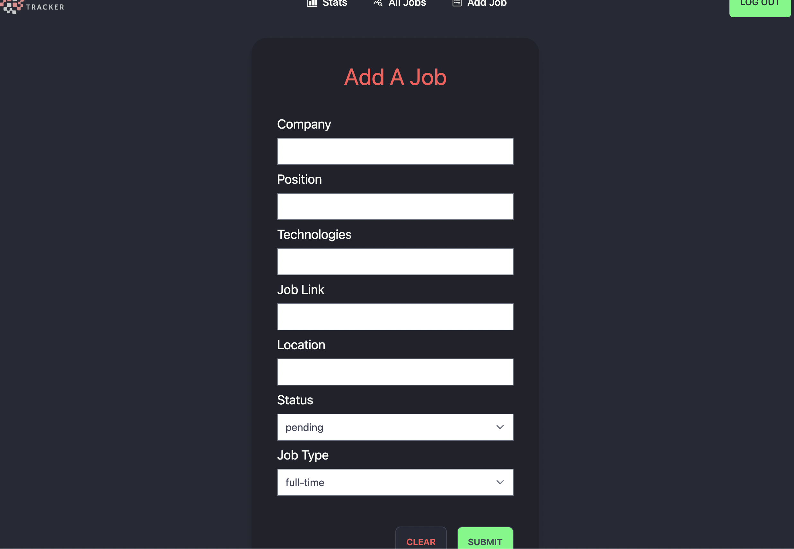

# Career Search Tracker
https://careersearchtracker.herokuapp.com/
A website that can be used to track your progress as you search for jobs.

MERN stack with TailwindCSS deployed on Heroku.
Custom built authentication for email/password.

 

 

 

 

# Getting Started with the app locally

To run locally:

npm start

That will start the server and client.